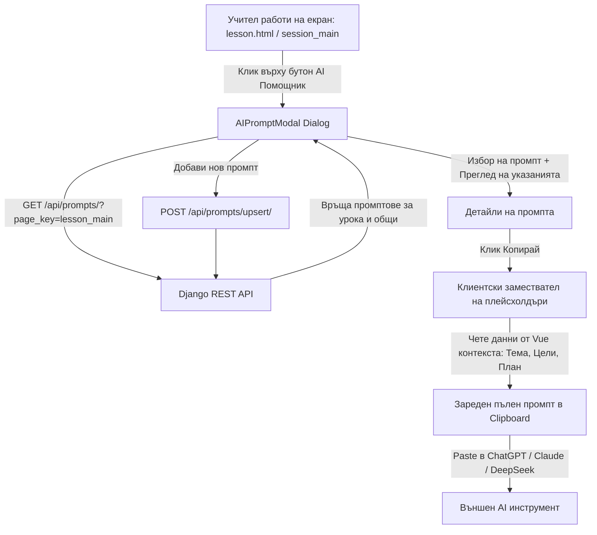

# Requirements

### Overview & Goals
Целта на разработката е да предостави на учителите в приложението **ИРИДА** удобен асистент за работа с изкуствен интелект (AI) при планирането и провеждането на уроци, без да се налага скъпа и сложна директна интеграция с конкретни AI API доставчици.

Вместо обвързване с конкретен AI модел, приложението поддържа **библиотека с предварително подготвени и проверени промптове (шаблони)**, съобразени със специфичния контекст на всяка страница. Учителят може да отвори модален диалог директно от страницата, на която работи, да избере подходящ промпт, да види указания за използването му, да го копира с един клик (с автоматично попълнени данни от текущия урок) и да го постави в предпочитания от него AI инструмент (напр. ChatGPT, Claude, Gemini, DeepSeek). Учителите също така могат лесно да добавят свои нови промптове, които автоматично се асоциират със съответната страница и се споделят с колегите им.

### Scope
#### In Scope
- **Модел на данните за промптове (`AIPrompt`)**: Съхранение на заглавие, текст на промпта, указания/коментар за ползване, идентификатор на страница (`page_key`), автор (`created_by`), признак за системен шаблон (`is_system`) и ред на подредба (`order`).
- **Контекстна филтрация по страници**: Всяка страница от системата (цели на курса, раздели, теми за уроци, подготовка на занятие, задачи за упражнения) има уникален ключ, по който се зареждат само релевантните промптове + общи системни шаблони.
- **Модален диалогов прозорец**: Бърз достъп през бутон/икона в интерфейса с преглед на наличните промптове, филтриране и указания.
- **Динамични променливи / контекстни шаблони**: Възможност промптът да съдържа плейсхолдъри като `{тема}`, `{предмет}`, `{клас}`, `{цели}`, `{фокус}`, които при копиране се попълват автоматично с данните от отворения екран.
- **Споделяне и създаване на нови промптове**: Форма за бързо добавяне на нов промпт директно от страницата с автоматично асоцииране към текущия екран и незабавна наличност за останалите учители.
- **REST API ендпоинти**: Извличане на промптове по страница, създаване, редакция и изтриване (за администратори/автори).
- **Django Admin интерфейс**: Пълно администриране и предварително зареждане (seed) на системни промптове.

#### Out of Scope
- Директни платени API извиквания към OpenAI/Anthropic/Google сървъри от бекенда на приложението.
- Изграждане на вграден чат-бот интерфейс (потребителят ползва външния си AI чат през клипборда).

### User Stories
- **Като учител**, искам докато подготвям точките от плана и задачите за урок, да отворя списък с промптове за урока, за да избера най-подходящия промпт за генериране на упражнения или обобщение.
- **Като учител**, искам да виждам указания и препоръки към всеки промпт, за да знам какъв резултат да очаквам и как най-добре да го приложа във външния AI модел.
- **Като учител**, искам при копиране на промпта променливите като име на урока, предмет и цели да се попълват автоматично, за да не ги преписвам ръчно.
- **Като учител**, искам да мога да запазя свой успешен промпт за конкретната страница, така че да го ползвам отново и да го споделя с колегите си.
- **Като администратор**, искам да мога да зареждам и редактирам системни пр��верени промптове през Django Admin.

### Functional Requirements
1. **Каталог на промптовете**:
   - Всеки запис съдържа: `title` (заглавие), `page_key` (идентификатор на страницата), `prompt_text` (шаблон на промпта), `instructions` (коментар и указания за употреба), `is_system` (служебен ли е), `created_by` (автор).
2. **Контекстна филтрация**:
   - При отваряне на модала от екран с `page_key='lesson_main'`, се извличат промптовете за `lesson_main` и общите `general`.
3. **Копиране и заместване на данни**:
   - Бутон "Копирай промпта" копира форматирания текст в клипборда с визуален статус за успех (tooltip / badge "Копирано!").
   - При наличие на плейсхолдъри (`{предмет}`, `{тема}`, `{цели}` и др.), клиентският скрипт замества таговете с актуалните стойности от JS състоянието на активната страница.
4. **Създаване на нов промпт от потребителя**:
   - В модалния прозорец има таб / бутон "Добави нов промпт".
   - Полето за страница автоматично приема текущия `page_key`.
   - След запис новият промпт се появява веднага в списъка.

### Non-Functional Requirements
- **Бързина и лекота**: Модалът и заявките работят мигновено, без забавяне на зареждането на основната страница.
- **Сигурност**: Валидация на входните данни и защита срещу XSS при визуализация на текста на промптовете.
- **Съвместимост**: Работа на всички съвременни браузъри с Clipboard API (`navigator.clipboard`).

# Technical Design

### Current Implementation
- Проектът `irida_app` е изграден на **Django 5.x** с **Django REST Framework (DRF)**.
- Домейните са модулно организирани в `main/models/` (`curriculum.py`, `lessons.py`, `schools.py`, `accounts.py`), с реекспорт в `main/models/__init__.py`.
- Frontend архитектурата използва **Bootstrap 5**, **Vue 3 (CDN)**, **Axios** и **TinyMCE** за динамичните страници на уроците (`irida_app/frontend/irida/js/lesson.js`, `session_main.js`).
- HTML страниците се рендират през Django шаблони (`templates/main/`), които използват общ базов шаблон `base.html` и зареждат Vue приложението върху `#main_app`.

### Key Decisions
1. **Споделена библиотека с промптове**: Всички създадени от учителите промптове са видими за колегите им, насърчавайки обмяната на добри педагогически практики и успешни структури за уроци.
2. **Модален диалогов прозорец (`Bootstrap Modal`)**: Предоставя фокус и чист интерфейс без претрупване на работната площ на страницата.
3. **Динамично заместване на плейсхолдъри от контекста**: Клиентският модул прихваща контекста на текущия урок (тема, цели, точки от плана) и автоматично ги замества в шаблона при натискане на "Копирай".
4. **Идентификация по `page_key`**: Използва се стандартизиран стринг ключ (напр. `lesson_main`, `course_goals`, `course_units`, `session_list`, `general`), задаван чрез HTML data атрибут (`data-page-key`) в шаблона или изгледа.

### Data Models
Нов модел в `irida_app/main/models/prompts.py`:

```python
class AIPrompt(models.Model):
    PAGE_CHOICES = [
        ('general', 'Общи промптове'),
        ('course_goals', 'Цели на курс/предмет'),
        ('course_units', 'Учебни раздели/модули'),
        ('course_lessons', 'Теми за уроци'),
        ('session_list', 'Списък с уроци'),
        ('lesson_main', 'Подготовка на урок / занятие'),
        ('school_day', 'Учебен ден и програма'),
    ]

    title = models.CharField('Заглавие / Име', max_length=200)
    page_key = models.CharField('Страница / Контекст', max_length=50, choices=PAGE_CHOICES, default='general', db_index=True)
    prompt_text = models.TextField('Текст на промпта', help_text='Поддържа плейсхолдъри: {предмет}, {тема}, {ц��ли}, {фокус}, {точки}')
    instructions = models.TextField('Указания за ползване', blank=True, default='', help_text='Препоръки за очакван резултат и настройки на AI модела')
    is_system = models.BooleanField('Системен шаблон', default=False)
    order = models.SmallIntegerField('Подредба', default=1)
    created_by = models.ForeignKey(User, verbose_name='Създаден от', on_delete=models.SET_NULL, null=True, blank=True, related_name='ai_prompts')
    created_at = models.DateTimeField('Създаден на', auto_now_add=True)
    updated_at = models.DateTimeField('Обновен на', auto_now=True)

    class Meta:
        verbose_name = 'AI Промпт'
        verbose_name_plural = 'AI Промптове'
        ordering = ['page_key', 'order', 'title']
```

### API Endpoints
Маршрути в `irida_app/main/api_urls.py`:
- `GET /api/prompts/?page_key=lesson_main` – Връща списък с активните промптове за съответната страница плюс общите (`general`).
- `POST /api/prompts/upsert/` – Създаване или редактиране на промпт (записва `created_by=request.user`).
- `DELETE /api/prompts/<int:pk>/` – Изтриване на промпт (с проверка за права).

### UI & Architecture Diagram



### File Structure Changes
- **Нови файлове**:
  - `irida_app/main/models/prompts.py` – Модел за промптовете.
  - `irida_app/main/serializers/prompts.py` – DRF сериализатор.
  - `irida_app/main/views/api_prompts.py` – API изгледи за списък, създаване и изтриване.
  - `irida_app/templates/main/components/ai_prompt_modal.html` – Шаблон за модалния диалог.
  - `irida_app/frontend/irida/js/ai_prompts.js` – Скрипт за управление на модала, клипборда и плейсхолдърите.
- **Модифицирани файлове**:
  - `irida_app/main/models/__init__.py` – Експорт на `AIPrompt`.
  - `irida_app/main/serializers/__init__.py` – Експорт на `AIPromptSerializer`.
  - `irida_app/main/views/__init__.py` – Експорт на API изгледите.
  - `irida_app/main/api_urls.py` – Регистриране на новите ендпоинти.
  - `irida_app/main/admin.py` – Регистрация на `AIPromptAdmin`.
  - `irida_app/templates/main/base.html` – Включване на модала и AI скрипта.
  - `irida_app/templates/main/lesson.html`, `session_main.html`, `course_goals.html`, `course_units.html`, `course_lessons.html` – Задаване на `page_key` и добавяне на бутона за отваряне на асистента.

### Risks and Mitigations
- **Непопълнени плейсхолдъри**: Ако дадено поле (напр. цели на урока) е празно, заместването информира потребителя или поставя празен стринг вместо грешка.
- **Clipboard Permissions**: В браузъри без поддръжка на `navigator.clipboard` се прилага fallback с `document.execCommand('copy')` или се маркира текстът за ръчно копиране.

# Testing

### Validation Approach
Валидацията ще обхване бекенд функционалностите (модели, миграции, API валидация и права), както и интеграцията в потребителския интерфейс (зареждане по страници, заместване на динамични променливи и копиране в клипборда).

### Key Scenarios
1. **Преглед на специфични за страницата промптове**:
   - Отваряне на `lesson.html` (с `page_key='lesson_main'`).
   - Натискане на бутона "AI Помощник".
   - Проверка, че се зареждат само промптовете за подготовка на урок и общите системни шаблони, но не и промптове за други раздели.
2. **Динамично попълване на данни и копиране**:
   - Избор на промпт, съд��ржащ `{тема}` и `{цели}`.
   - Проверка, че в генерирания за копиране текст се визуализират актуалните данни от текущо отворения урок.
   - Натискане на "Копирай" и проверка на съдържанието в клипборда.
3. **Създаване на нов споделен промпт от учител**:
   - Попълване на заглавие, текст и указания в модалната форма.
   - Запис през API и проверка за валиден HTTP 201 отговор.
   - Проверка, че новосъздаденият промпт се появява веднага в списъка и съдържа правилния `page_key`.
4. **Администриране през Django Admin**:
   - Влизане в `/admin/main/aiprompt/`.
   - Проверка на филтрите по `page_key`, търсенето и маркирането като системен шаблон.

### Edge Cases
- Страница без въведени данни (напр. нов урок без цели и точки) – заместването трябва коректно да изчиства маркерите или да оставя празни полета без JS грешка.
- Опит за запис на промпт без задължителни полета (заглавие или текст) – валидацията връща коректни съобщения за грешка.
- Празен списък с промптове за дадена страница – модалът показва информативно съобщение и бутон за създаване на първи промпт.

# Delivery Steps

### ✓ Step 1: Модел на данните за AI промптове и Django Admin интеграция
Дефиниран е моделът `AIPrompt` в базата данни с поддръжка на страници, указания и начални системни промптове.

- Създаване на нов модел `AIPrompt` в `irida_app/main/models/prompts.py` с полета: `title`, `page_key`, `prompt_text`, `instructions`, `is_system`, `order`, `created_by`, `created_at` и `updated_at`.
- Експортиране на новия модел в `irida_app/main/models/__init__.py`.
- Регистриране на модела в `irida_app/main/admin.py` с филтри по `page_key` и потребител, търсене по текст и указания.
- Генериране и прилагане на Django миграция.
- Добавяне на първоначални (seed) промптове за подготовка на цели, план на урок, тестови въпроси и задачи за ученици.

### ✓ Step 2: REST API ендпоинти и сериализатори за промптове
Създадени са сигурни и валидирани REST API ендпоинти за извличане, създаване, редактиране и изтриване на промптове.

- Създаване на сериализатор `AIPromptSerializer` в `irida_app/main/serializers/prompts.py` (и реекспорт в `main/serializers/__init__.py`).
- Създаване на API изгледи в `irida_app/main/views/api_prompts.py`:
  - `AIPromptListView` / филтриране по `page_key` и включване на общите промптове (`general`).
  - `ai_prompt_upsert` / `AIPromptUpsertView` за създаване и редакция на промпт, автоматично асоцииращ `created_by=request.user` и текущия `page_key`.
  - `ai_prompt_delete` за изтриване на промпт.
- Регистриране на маршрутите в `irida_app/main/api_urls.py`.

### ✓ Step 3: Клиентски UI компонент за модален диалог и клипборд интеграция
Реализиран е преизползваем Bootstrap модален диалог с Vue.js логика за избор, преглед, копиране в клипборда и добавяне на нови шаблони.

- Създаване на шаблон `irida_app/templates/main/components/ai_prompt_modal.html` с модален прозорец: списък с промптове за активната страница, детайлен преглед на текста и указанията, бутон за бързо копиране и форма за създаване на нов промпт.
- Създаване на клиентски скрипт `irida_app/frontend/irida/js/ai_prompts.js` с методи за зареждане на промптове през Axios, поддръжка на клипборд API (`navigator.clipboard.writeText`) и визуален фийдбек.
- Реализиране на логика за динамично заместване на плейсхолдъри (`{тема}`, `{предмет}`, `{цели}`, `{фокус}`, `{точки}`) с реалните данни от активния контекст на страницата.
- Включване на модалния компонент в `irida_app/templates/main/base.html` или като модулен include.

### ✓ Step 4: Интеграция на AI модала в страниците за планиране и уроци
Всички целеви страници за подготовка и планиране на уроци са снабдени с бутон за достъп до AI библиотека и специфичен контекстен ключ.

- Добавяне на бутон "AI Помощник / Промптове" и дефиниране на `data-page-key` / контекстен идентификатор в ключовите страници:
  - `irida_app/templates/main/lesson.html` и `session_main.html` (`page_key: 'lesson_main'`) – за точки от плана, бележки, задачи и обобщения.
  - `irida_app/templates/main/course_goals.html` (`page_key: 'course_goals'`) – за формулиране на образователни цели.
  - `irida_app/templates/main/course_units.html` (`page_key: 'course_units'`) – за тематично разпределение и раздели.
  - `irida_app/templates/main/course_lessons.html` и `session_list.html` (`page_key: 'session_list'`) – за планиране на структурата на занятията.
- Свързване на динамичните полета на страницата с промпт мениджъра за автоматично заместване на контекстните данни преди копиране.