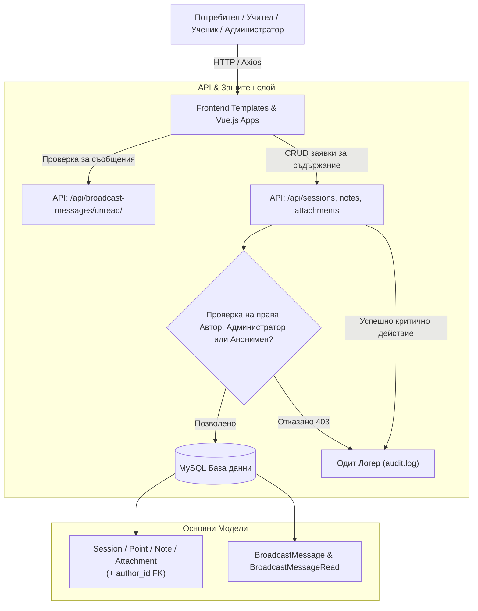

# Requirements

### Общ преглед и цели
Приложението `irida_app` се използва в реална среда от учители и ученици. За гарантиране на сигурността на учебните материали, проследимост на действията и навременна комуникация от администраторите към потребителите, се въвеждат три ключови функционалности:

1. **Специализиран одит лог (Audit / Security Log)**:
   - Записване във файлов лог на критични действия: автентикация, опити за неоторизиран достъп (403), създаване, редактиране и изтриване на уроци, планове, бележки, задачи, прикачени файлове и промени по потребителски роли.

2. **Авторство и защита на учебното съдържание (Authorship & Authorization)**:
   - Всички потребители могат да разглеждат съдържанието съгласно правата за достъп (ученици/учители).
   - Само авторът на съответния материал или системен/училищен администратор може да го редактира или изтрива.
   - Запазване на наличното съдържание без автор като „Анонимен автор“ („Системен материал“), което автоматично придобива авторство при първа редакция от потребител.
   - Опция за администраторите при редакция: запазване на оригиналния автор или прехвърляне/маркиране като собствено съдържание.

3. **Броадкаст съобщения (Broadcast Messages & Announcements)**:
   - Администраторите могат да публикуват общи съобщения или таргетирани по роля (учители, ученици, администратори).
   - Проверка при зареждане/вход на потребителя за непрочетени съобщения и извеждането им в модален прозорец.
   - Механизъм за ��аркиране на съобщенията като прочетени, така че да не се показват повторно.

---

### Обхват (Scope)

#### В обхват (In Scope)
- **Файлов логер**: конфигуриране на ротиращ се лог файл (напр. `audit.log` / `activity.log`), помощен модул за одит логване с IP, потребител, действие и статус.
- **Авторство на моделите**:
  - `Session` (Урок / занятие)
  - `SessionPoint` (Точка от плана на урока)
  - `SessionNote` (Теоретични / приложни бележки)
  - `SessionTask` (Задачи към точка от план)
  - `SessionAttachment` (Прикачени файлове към урок)
  - (Включително проверка и хармонизиране със съществуващите `Subject`, `AppAttachment`, `AIPrompt`).
- **Бекенд защита (Authorization)**: DRF permissions и view проверки с връщане на `403 Forbidden` при опит за модификация на чуждо съдържание.
- **Миграции и съвместимост**: поддръжка на `author = null` (анонимно съдържание), автоматично присвояване при първа редакция, администраторски флаг `keep_original_author`.
- **Броадкаст модел и API**: модели `BroadcastMessage` и `BroadcastMessageRead`, REST API за извличане на непрочетени съобщения и маркиране като прочетени, Django Admin интеграция.
- **Фронтенд интеграция**: визуализация на автора, скриване/заключване на бутони за редакция/изтриване за чужди материали, модален прозорец за системни съобщения.

#### Извън обхват (Out of Scope)
- Пълна система за вътрешен чат/лични съобщения между отделни потребители.
- Версиониране на историята на промените (git-like revision tree) за всяка отделна редакция на текст.

---

### Потребителски истории (User Stories)

- **Като учител (автор)**, искам създадените от мен уроци, точки от план, бележки и приложения да не могат да бъдат променяни или изтривани от други колеги, за да съм сигурен, че трудът ми е защитен.
- **Като учител**, искам да мога да виждам уроците и бележките на колегите си, за да обменяме опит и учебни практики.
- **Като учител**, когато отворя и редактирам наличен общ/анонимен урок за първи път, искам системата автоматично да го запише като мой авторски урок.
- **Като администратор**, когато коригирам правописна грешка в урок на колега, искам да мога да избера да запазя оригиналния автор, без да си присвоявам чуждия труд, или при необходимост да сменя автора.
- **Като администратор**, искам да изпращам важни съобщения до всички учители или до всички ученици, които да им се показват на екрана при влизане.
- **Като потребител (учител/ученик)**, когато вляза в системата и има ново съобщение за моята роля, искам да го видя в удобен модален прозорец и след като натисна „Разбрах“, то да не ми се показва повече.
- **Като системен администратор**, искам критичните действия (вход, опит за неоторизирано изтриване, промени по права) да се записват в защитен одит лог файл за последващ анализ.

# Technical Design

### Съществуваща архитектура
- **Django + Django REST Framework** с MySQL база данни.
- **Модели**: `UserProfile` (`accounts.py`), `Session`, `SessionPoint`, `SessionNote`, `SessionTask`, `SessionAttachment` (`lessons.py`), `Subject` (`curriculum.py`), `AppAttachment` (`attachments.py`).
- **Роли**: дефинирани в `constants.py` (`SUPERADMIN=1`, `GUESTADMIN=2`, `SCHOOLADMIN=3`, `TEACHER=4`, `STUDENT=5`).
- **Фронтенд**: серверно рендерирани HTML шаблони (`templates/main/`) в комбинация с Vue 3 CDN компоненти (`frontend/irida/js/`) и Axios за REST комуникация.

---

### Архитектурна диаграма



---

### Ключови решения (Key Decisions)

1. **Модел на авторство**:
   - Добавя се `author = models.ForeignKey(User, on_delete=models.SET_NULL, null=True, blank=True, related_name='...')` към `Session`, `SessionAttachment`, `SessionPoint`, `SessionNote`, `SessionTask`.
   - За точките от плана, бележките и задачите авторството по подразбиране следва автора на урока (`Session`), освен ако изрично не е зададено друго.
   - Ако `author is None`: обектът се третира като общ/анонимен. При редакция от учител `instance.author` се задава на `request.user`.

2. **Администраторска гъвкавост при редакция**:
   - При изпращане на PUT/PATCH/POST към API за редакция, администраторите могат да подадат флаг `keep_original_author: true` (по подразбиране за администратори) или `claim_ownership: true` / нов `author_id`.

3. **Одит логване (Audit Logging)**:
   - Създава се файлов логер `irida.audit` с `RotatingFileHandler` (записва в `logs/audit.log` с максимален размер и ротация).
   - Формат на записите: `[YYYY-MM-DD HH:MM:SS] [LEVEL] [IP] [USER_ID:username] [ROLE] [ACTION] [TARGET_ENTITY:ID] [STATUS] [DETAILS]`.
   - Специална помощна функция `log_audit_event(request, action, target_model, target_id, status, details)`.

4. **Броадкаст известия (Broadcast Notifications)**:
   - Модел `BroadcastMessage`: заглавие, тяло (текст/HTML), целева роля (`ALL`, `TEACHER`, `STUDENT`, `ADMIN`), период на валидност (`expires_at`, `is_active`), `created_by`.
   - Модел `BroadcastMessageRead`: релация (`message`, `user`, `read_at`) с `unique_together = ('message', 'user')`.
   - При зареждане на страницата frontend извиква `/api/broadcast-messages/unread/`. При наличие на записи се отваря модален прозорец. При клик на „Разбрах“ се изпраща POST към `/api/broadcast-messages/<id>/mark-read/`.

---

### Спецификация на моделите и контрактите

#### Модел `BroadcastMessage` & `BroadcastMessageRead`
```python
class BroadcastMessage(models.Model):
    AUDIENCE_ALL = 0
    AUDIENCE_TEACHER = 4
    AUDIENCE_STUDENT = 5
    AUDIENCE_ADMIN = 1
    
    AUDIENCE_CHOICES = [
        (AUDIENCE_ALL, 'Всички потребители'),
        (AUDIENCE_TEACHER, 'Учители'),
        (AUDIENCE_STUDENT, 'Ученици'),
        (AUDIENCE_ADMIN, 'Администратори'),
    ]

    title = models.CharField('Заглавие', max_length=200)
    message = models.TextField('Текст на съобщението')
    target_role = models.PositiveSmallIntegerField('Целева група', choices=AUDIENCE_CHOICES, default=AUDIENCE_ALL)
    is_active = models.BooleanField('Активно', default=True)
    created_by = models.ForeignKey(User, on_delete=models.SET_NULL, null=True, blank=True, verbose_name='Създадено от')
    created_at = models.DateTimeField('Създадено на', auto_now_add=True)
    expires_at = models.DateTimeField('Валидно до', null=True, blank=True)

class BroadcastMessageRead(models.Model):
    message = models.ForeignKey(BroadcastMessage, on_delete=models.CASCADE, related_name='reads')
    user = models.ForeignKey(User, on_delete=models.CASCADE, related_name='read_broadcasts')
    read_at = models.DateTimeField('Прочетено на', auto_now_add=True)

    class Meta:
        constraints = [
            models.UniqueConstraint(fields=['message', 'user'], name='unique_user_broadcast_read')
        ]
```

---

### Засегнати файлове и структура

- **Конфигурация & Настройки**:
  - `irida_app/config/settings/base.py`, `dev.py`, `prod.py` (настройка на `LOGGING` с `RotatingFileHandler`).
- **Модели**:
  - `irida_app/main/models/lessons.py` (добавяне на `author` към `Session`, `SessionPoint`, `SessionNote`, `SessionTask`, `SessionAttachment`).
  - `irida_app/main/models/broadcasts.py` (нов файл за `BroadcastMessage` и `BroadcastMessageRead`).
  - `irida_app/main/models/__init__.py` (експорт на новите модели).
- **Помощни функции & Одит**:
  - `irida_app/main/audit.py` (нов модул за структурирано записване в `audit.log`).
- **Сериализатори**:
  - `irida_app/main/serializers/lessons.py`, `attachments.py`, `broadcasts.py` (нови полета `author_name`, `is_author`, `can_edit`).
- **Изгледи и API маршрути**:
  - `irida_app/main/views/api_lessons.py`, `api_attachments.py`, `api_broadcasts.py`, `auth.py`.
  - `irida_app/main/api_urls.py`.
  - `irida_app/main/admin.py` (регистрация на `BroadcastMessage` и авторски полета).
- **Фронтенд & Шаблони**:
  - `irida_app/templates/main/base.html`, `session_list_base.html`, `lesson.html`.
  - `irida_app/frontend/irida/js/session_list.js`, `session_main.js`, `lesson.js`, `attachments.js`, `broadcast_modal.js`.

# Testing

### Подход за тестване и валидация

Всички нови функционалности ще бъдат валидирани чрез автоматизирани Django/DRF тестове (`main/tests.py` или специализирани тестови модули) и интеграционни сценарии.

---

### Основни сценарии за валидация

1. **Авторство и права за модификация**:
   - Потребител `Учител А` създава урок. Потребител `Учител Б` опитва PUT/PATCH/DELETE към този урок -> очакван отговор `403 Forbidden`.
   - Потребител `Учител А` редактира своя урок -> отговор `200 OK`, авторът остава `Учител А`.
   - Потребител `Администратор` редактира урока на `Учител А` с опция `keep_original_author=True` -> отговор `200 OK`, авторът остава `Учител А`.
   - Потребител `Администратор` редактира урока на `Учител А` с опция `claim_ownership=True` -> отговор `200 OK`, авторът става `Администратор`.

2. **Анонимно / съществуващо съдържание**:
   - Урок с `author=None` се отваря и редактира от `Учител А` -> отговор `200 OK`, след записа `author` става `Учител А`.

3. **Одит лог файл (`audit.log`)**:
   - Проверка, че всяко създаване, редакция, изтриване и неуспешен опит (403) генерира форматиран ред в `audit.log` с коректни данни (IP, потребител, роля, действие, резултат).

4. **Броадкаст съобщения**:
   - Администратор създава съобщение за роля `TEACHER`.
   - Учител влиза в системата -> API връща съобщението в `/api/broadcast-messages/unread/`.
   - Ученик влиза в системата -> съобщението не се връща.
   - Учителят маркира съобщението като прочетено -> последващо извикване на `/api/broadcast-messages/unread/` връща празен списък.

# Delivery Steps

### ✓ Step 1: Конфигуриране на специализиран файлов одит лог (Audit Logging)
Създаване на специализиран модул за одит и сигурност с файлов логер и обслужващи функции:
- Конфигуриране на файлов логер `irida.audit` в `irida_app/config/settings/base.py`, `dev.py` и `prod.py` с ротация на файловете (`audit.log` / `activity.log`).
- Създаване на помощен модул `irida_app/main/audit.py` с функции за структурирано записване на критични събития (потребител, IP адрес, действие, целеви обект, резултат, статус).
- Интегриране на одит логването при автентикация (вход, неуспешен вход, изход) и при опити за неразрешен достъп (403 Forbidden).

### ✓ Step 2: Разширяване на моделите и сериализаторите с авторство (Authorship & Ownership)
Добавяне на авторство към основните урочни и учебни единици с поддръжка на наследено/анонимно съдържание:
- Добавяне на полета `author` / `created_by` (ForeignKey към `User`, `null=True, blank=True`) към моделите в `irida_app/main/models/lessons.py` (`Session`, `SessionAttachment`, `SessionPoint`, `SessionNote`, `SessionTask`).
- Генериране и прилагане на Django миграции, като съществуващото съдържание остава с `author=None` ("Анонимен автор").
- Актуализиране на сериализаторите в `irida_app/main/serializers/` (`lessons.py`, `curriculum.py`, `attachments.py`) с полета за автор, име на автора и изчислен флаг `can_edit` / `is_author`.

### ✓ Step 3: Бекенд защита на учебното съдържание и правила за редакция
Внедряване на строг контрол на достъпа при четене, създаване, редактиране и изтриване:
- Реализиране на DRF Permission клас (напр. `IsAuthorOrAdminOrReadOnly`) и споделен помощен механизъм за проверка на правата.
- Актуализиране на изгледите в `irida_app/main/views/api_lessons.py`, `api_curriculum.py` и `api_attachments.py`.
- Реализиране на логиката за анонимно съдържание: при първа редакция от учител/потребител, материалът автоматично придобива автор текущия потребител.
- Добавяне на параметър за администратори (напр. `keep_original_author` / `claim_ownership`) при редакция, позволяващ запазване на оригиналното авторство или маркиране като собствен материал.
- Логване на всички успешни редакции/изтривания и на отхвърлените опити за модификация в одит лог файла.

### ✓ Step 4: Модул за броадкаст съобщения (Broadcast Messages)
Създаване на модели, API и Django Admin интерфейс за системни известия:
- Създаване на модели `BroadcastMessage` (заглавие, съдържание, целева роля, валидност, автор) и `BroadcastMessageRead` (проследяване на прочетени съобщения по потребители) в `irida_app/main/models/`.
- Създаване на API endpoints в `irida_app/main/views/` и `irida_app/main/api_urls.py` (`/api/broadcast-messages/unread/`, `/api/broadcast-messages/<id>/mark-read/` и CRUD за администратори).
- Регистриране на моделите в `irida_app/main/admin.py` с удобни филтри и статистика за прочитанията.

### ✓ Step 5: Потребителски интерфейс за авторство и модални съобщения
Визуализация на авторството, заключване на контролите и модален прозорец за известия:
- Обновяване на Vue приложенията и шаблоните (`session_list.js`, `session_main.js`, `lesson.js`, `subjects.js`, `attachments.js`) за показване на автора и деактивиране/скриване на бутоните за редакция и изтриване за потребители без права.
- Добавяне на администраторски контрол (checkbox/toggle) във формата за редакция: "Запази оригиналния автор" vs "Маркирай като мой/собствен".
- Създаване на глобален модален компонент в базовите шаблони (`base.html` / `session_list_base.html`), който при вход зарежда активните непрочетени съобщения и предлага бутон "Разбрах / Маркирай като прочетено".