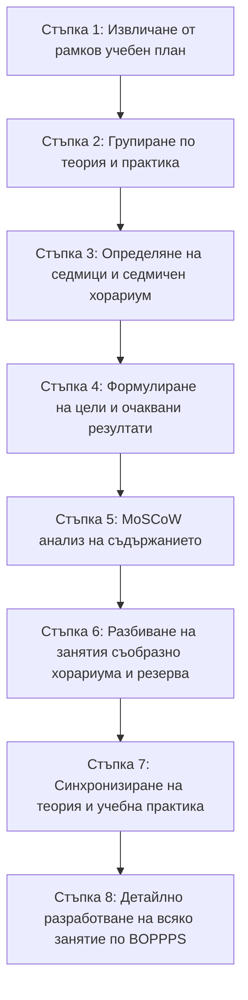

# Методика и алгоритъм за планиране на детайлизирани училищни учебни програми и уроци
> **Проект „ИРИДА“**  
> **Автор:** инж. Георги Бориков  
> **Основа:** Методическа разработка за специалност „Приложно програмиране“ (ПГЕЕ – Банско, 2025 г.)

---

## 1. Основни педагогически модели и принципи

### 1.1. BOPPPS (5PPPS) модел за структура на занятие
Използва се за планиране и структуриране на всяко конкретно занятие/урок (обикновено 90-минутен блок):
1. **Bridge-In (Въведение и мотивация)** – Поставяне на контекста и привличане на вниманието чрез реален казус или житейски пример.
2. **Outcomes / Stated Outcomes (Очаквани резултати / Цели)** – Ясно формулирани конкретни цели и умения, които ученикът ще усвои.
3. **Pre-Assessment (Предварителна диагностика)** – Бърза проверка на входното ниво и предишни знания (въпроси, кратка анкета).
4. **Participatory Learning (Активно / Участническо учене)** – Сърцевината на урока: кратка теория + демо код, съвместна работа и самостоятелна практика.
5. **Post-Assessment (Оценка на изхода)** – Проверка на постигнатите резултати (мини-викторина, демонстрация на код, 3–4 бързи въпроса).
6. **Summary (Обобщение и самостоятелна работа)** – Обобщение на основните изводи и поставяне на домашна/самостоятелна задача.

### 1.2. GRR модел (Постепенно освобождаване на отговорност)
Осигурява плавен преход от преподавателско ръководство към ученическа независимост при усвояване на нови знания и софтуерни умения:
1. **Директно обучение (Аз правя)** – Учителят демонстрира синтаксис, структура, конзолни команди и примерни реализации.
2. **Ръководена практика (Ние правим заедно)** – Учител и ученици пишат общ клас/функция с моментално обяснение на всеки ред.
3. **Сътрудничество при учене (Вие правите заедно)** – Работа по двойки (pair programming) или малки екипи за решаване на казуси.
4. **Самостоятелна работа (Ти правиш сам)** – Всеки ученик самостоятелно разработва задачата с възможност за диференцирана помощ.

### 1.3. Принципът FLOW (Оптимален учебен климат)
- **Fit (Уместност и приложимост):** Адаптиране на учебното съдържание спрямо реалното ниво на учениците и материалната база.
- **Lend (Помощ и съдействие):** Диференцирана подкрепа за по-бавните и допълнителни задачи за напредналите ученици.
- **Optimize (Оптимизиране):** Фокус върху практическо приложение, преизползваемост на кода и чести упражнения.
- **Work (Сътрудничество):** Създаване на екипна култура в класната стая, подобна на софтуерна фирма.

### 1.4. MoSCoW (MSCW) анализ за приоритизация
Метод за разпределение на темите и учебното съдържание при ограничено учебно време:
- **Must (Задължително ядро):** Фундаментални концепции, без които не може да се продължи напред; покриват ДОС и базовата грамотност.
- **Should (Важно, силно препоръчително):** Важни теми, даващи дълбочина и професионална стойност; могат да се компресират или преместят при недостиг на време.
- **Could (Пожелателно / За напреднали):** Обогатяващи и абстрактни теми за любопитните и бързо напредващите; включват се при наличен резерв от часове.
- **Won't / Cancel (Отпадащо за текущия цикъл):** Теми, които са твърде тясно специализирани, остарели или неподходящи за конкретния клас/профил.

### 1.5. Автентична технологична среда
- Професионални среди за разработка: **Python**, **PyCharm**, Linux среда / **Git Bash**, **Jupyter Notebooks**, **GitHub**.

---

## 2. 8-стъпков алгоритъм за планиране и адаптация

### Стъпка 1: Анализ на рамковия (типовия) учебен план
- **Вход:** Национален рамков учебен план за специалността (утвърден от МОН).
- **Действие:** Извличане на предметите от отрасловата и специфичната професионална подготовка (раздели III, IV и V).
- **Резултат:** Списък на професионалните дисциплини по класове и общ хорариум.

### Стъпка 2: Групиране по теория / практика
- **Действие:** Всяка дисциплина се разделя на теоретична част (Теория на професията) и практическа част (Учебна практика).
- **Атрибути:** Добавят се колони: `Клас`, `Тип` (Теория / Практика), `Годишен брой часове`.

### Стъпка 3: Определяне на учебните седмици и разписание
- **Действие:** Разпределяне на годишните часове по сроков�� и учебни седмици:
  - 1 срок / цяла година: 18 седмици (срок) или 36 седмици (година) за 8–11 клас; 29 седмици (18 + 11) за 12 клас.
- **Синтаксис за блокове:**
  - `2` = блок от 2 учебни часа веднъж седмично.
  - `2/3` = 2 часа/седмица през I срок и 3 часа/седмица през II срок.
  - `2x1 + 1x2` = два пъти по 1 час и един блок от 2 часа.

### Стъпка 4: Формулиране на цели и задачи по предмети
- **Действие:** Дефиниране на ясни педагогически и професионални цели за всеки предмет, адаптирани към профила на училището и ДОС.

### Стъпка 5: MoSCoW анализ на учебното съдържание
- **Действие:** Всяка тема от официалната програма се категоризира в една от четирите категории (M / S / C / W) с писмена обосновка.
- **Критерии за класификация:**
  - **Must:** Ядро на предмета, синтактични основи, критични принципи, обработка на грешки.
  - **Should:** Разширени концепции, шаблони за проектиране, оптимизации.
  - **Could:** Управление на ниско ниво (памет, стек, хип), рефлексия, вътрешни детайли.
  - **Won't:** Специфични библиотеки или тясно специализирани механизми, които се отлагат за друг курс.

### Стъпка 6: Разбиване на програмата на занятия (уроци)
- **Действие:** Разпределение на темите по блокови занятия (обикновено по 2 учебни часа = 90 минути) съобразно хорариума на разделите и **резерва от часове** (напр. 60 часа задължителни + 12 часа резерв = 72 часа).
- **Правило за подредба:**
  - *Must* темите се покриват в първите занятия на съответния раздел.
  - *Should* темите се включват за задълбочаване и практическо затвърждаване.
  - *Could* темите и преговорите се планират в последните или резервните ��асове на раздела.

### Стъпка 7: Синхронизиране на теория и учебна практика
- **Критични правила:**
  1. **Учебната практика не може да изпреварва теорията.**
  2. **Учебната практика трябва изцяло да покрива и надгражда взетата теория** с реални практически проекти и казуси.

### Стъпка 8: Детайлно разработване на всяко занятие (BOPPPS план)
- **Действие:** Изготвяне на детайлен сценарий за всяко 90-минутно занятие с точно разпределение на времето, демо код, дидактически материали, упражнения и оценяване.

---

## 3. Стандартна структура и тайминг на 90-минутно занятие (BOPPPS)

| Етап | Фаза по BOPPPS / GRR | Описание и дейност | Време (мин) |
| :--- | :--- | :--- | :---: |
| **0** | **Подготовка** | Проверка на техника, среда за програмиране (PyCharm/Git) и стартов код. | *(преди часа)* |
| **1** | **Bridge-In** *(Въведение)* | Мотивационен въпрос, житейска аналогия, реален софтуерен казус, преговор. | **5 мин.** |
| **2** | **Outcomes** *(Цели)* | Обявяване на конкретните практически умения, които ще се придобият. | **5 мин.** |
| **3** | **Презентация + Демо код** *(GRR: Директно)* | Стегната теория, синтаксис, писане и показване на демо код в реално време. | **15 мин.** |
| **4** | **Дискусия и рефлексия** | Въпроси за разбиране към класа, обратна връзка и дискусия. | **7 мин.** |
| **5** | **Съвместно упражнение** *(GRR: Ръководено)* | Писане на общ код/клас на дъската заедно с учениците с обяснение ред по ред. | **8 мин.** |
| **6** | **Самостоятелна практика** *(GRR: Самостоятелно)* | Учениците решават практическа задача; учителят подпомага индивидуално. | **25 мин.** |
| **7** | **Проверка и споделяне** | Ученици демонстрират решенията си на екран; анализ на добри практики. | **10 мин.** |
| **8** | **Мини-викторина** *(Post-Assessment)* | 3–4 бързи тестови въпроса (онлайн или на хартия) за проверка на усвояването. | **7 мин.** |
| **9** | **Summary & Домашно** | Синтезирано обобщение на ключовите изводи и възлагане на задача за вкъщи. | **8 мин.** |
| **Общо** | | | **90 мин.** |

---

## 4. Задължителни елементи в учебното съдържание за занятие

Всяко разработено занятие в системата **ИРИДА** трябва да съдържа:
1. **Метаданни:** Номер на занятие, тема, предмет, раздел, клас, вид (теория / практика), хорариум.
2. **MoSCoW състав:** Списък на включените теми с означение `[Must]`, `[Should]`, `[Could]`.
3. **Цели и очаквани резултати:** 2–3 измерими цели с глаголи за действие (дефинира, създава, прилага, тества).
4. **Теоретични бележки:** Кратък, стегнат конспект без излишен академичен баласт.
5. **Примерен демо код:** Чист, коментиран и работещ код на съответния програмен език (напр. Python).
6. **Задачи за упражнение:**
   - *Съвместна задача (с учителя)* – малък пример с готово решение за съвместно кодиране.
   - *Самостоятелна задача (за учениците)* – практическо задание с ясни изисквания и упътване.
7. **Мини-викторина / Въпроси за самопроверка:** 3–4 бързи въпроса с верни отговори за моментална обратна връзка.
8. **Домашна работа / Предизвикателство за напреднали:** Задача за самостоятелно упражнение или разширение.
